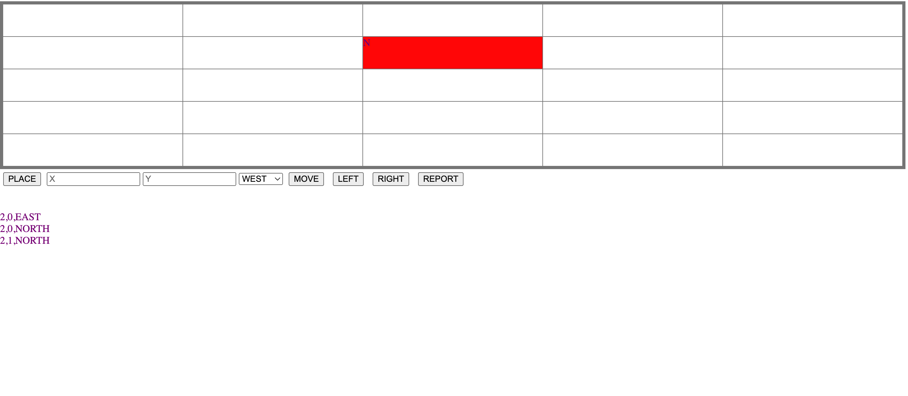

# AI MEDIA TOY ROBOT TASK



### INSTALLATION

To prevent any issues with running this application you should run npm install

`npm install`

Although the solution uses no external libraries but you will get some warning if run without `npm i`

I used the node version v18.12.1 to build this application

### CLI Solution

There is a cli interface to this application that can be run with the command.

`npm run run-cli`

After this it will ask for command according to the task. Use PLACE commands to start and REPORT command to get details at any moment.
Everything is case-sensitive as describe in the task email.

### UI Solution

I also implemented a UI solution to this. Which renders the board and has buttons/input for all the commands. There is no validation on inputs but the console output is displayed at the botton
after every command.
I cleverly intercepted the console.log command to display all logs in html.

To run the UI solution use the script

`npm run start `

### Test File

There is a file named 'cli/tests.ts' which imports the Robot class and runs the command. It can be used if want to quickly tests some scenarios using code. It can be run using.

`npm run run-tests`

### Robot Class Explaination

# Robot Class

The `Robot` class is a TypeScript implementation of a robot that can be placed on a grid, move in different directions, and report its position and direction. The robot is designed to follow specific commands: PLACE, MOVE, LEFT, RIGHT, and REPORT. The main purpose of this class is to provide a simple interface for controlling a robot on a 5x5 grid.

## Class Components

### Position Type

```typescript
type Position = {
  x: number;
  y: number;
};
```

The Position type is an object that represents the x and y coordinates of the robot on the grid.

### Direction Enum

```typescript
export enum Direction {
  NORTH = "NORTH",
  WEST = "WEST",
  SOUTH = "SOUTH",
  EAST = "EAST",
}
```

vbnet
Copy code

# Robot Class

The `Robot` class is a TypeScript implementation of a robot that can be placed on a grid, move in different directions, and report its position and direction. The robot is designed to follow specific commands: PLACE, MOVE, LEFT, RIGHT, and REPORT. The main purpose of this class is to provide a simple interface for controlling a robot on a 5x5 grid.

## Class Components

### Position Type

```typescript
type Position = {
  x: number;
  y: number;
};
```

The Position type is an object that represents the x and y coordinates of the robot on the grid.

Direction Enum

```typescript
export enum Direction {
  NORTH = "NORTH",
  WEST = "WEST",
  SOUTH = "SOUTH",
  EAST = "EAST",
}
```

The Direction enumeration represents the four possible directions the robot can face: NORTH, WEST, SOUTH, and EAST.

### CommandDirection Enum

```typescript
enum CommandDirection {
  LEFT,
  RIGHT,
}
```

The CommandDirection enumeration represents the two possible direction change commands the robot can receive: LEFT and RIGHT.

### Robot Class

The Robot class contains several private properties, including the current direction (currentDirection), the current position (currentPosition), and a static boardSize property that represents the size of the grid.

The class has several public methods that allow users to interact with the robot:

`isPlaced()`: checks if the robot has been placed on the grid.

`commandMove()`:moves the robot one step forward in its current direction.

`commandLeft()`:rotates the robot 90 degrees counterclockwise.

`commandPlace() `:x: number, y: number, dir: Direction): places the robot on the grid at the specified position and direction.

`commandRight()`rotates the robot 90 degrees clockwise.

`commandReport()`: returns the current position and direction of the robot as a string.

### Private Methods

The class also contains several private helper methods:

`getNewPosition()`: calculates the new position of the robot based on its current direction.
`getNewDirection(command: CommandDirection)`: calculates the new direction of the robot based on the received command (LEFT or RIGHT).

`isValidPosition(position: Position)`: checks if the given position is within the grid boundaries.

## Usage

To use the `Robot` class, create an instance of the class, and then use the public methods to send commands to the robot. Make sure to place the robot on the grid before sending any other commands.

```typescript
const robot = new Robot();

// Place the robot at position (0, 0) facing NORTH.
robot.commandPlace(0, 0, Direction.NORTH);

// Move the robot one step forward.
robot.commandMove();

// Rotate the robot to the left (counterclockwise).
robot.commandLeft();

// Rotate the robot to the right (clockwise).
robot.commandRight();

// Report the current position and direction of the robot.
console.log(robot.commandReport()); // "0,1,NORTH"
```

Remember that the robot will ignore invalid commands, such as moving off the grid or attempting to change direction before being placed on the grid.
